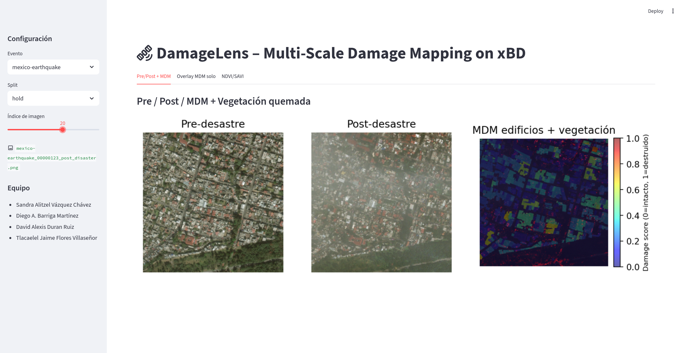

# **DamageLens – Análisis Multi-Escala de Daños por Terremoto e Incendio**

Este proyecto implementa un sistema completo de visión computacional para analizar daños producidos por desastres
naturales utilizando imágenes satelitales del dataset **xBD (xView2)**. Se desarrolló un pipeline innovador que combina
segmentación geométrica, clasificación de daños, análisis multiespectral de vegetación y mapas de daño multi-escala (
MDM), junto con un dashboard interactivo en Streamlit.

### Authors

- Sandra Alitzel Vázquez Chávez
- Diego A. Barriga Martínez
- David Alexis Duran Ruiz
- Tlacaelel Jaime Flores Villaseñor

---

## 📦 Dataset

El dataset utilizado es **xBD / xView2**, descargable desde:

➡️ https://xview2.org/download-links

Para este proyecto se emplearon únicamente los eventos:

- `mexico-earthquake`  
- `santa-rosa-wildfire`

Cada evento contiene:

- Imágenes pre-desastre y post-desastre  
- Polígonos de edificios en formato JSON  
- Etiquetas de daño por edificio:
  - `no-damage`  
  - `minor-damage`  
  - `major-damage`  
  - `destroyed`  

---

##  Objetivos del Proyecto

1. Clasificar el nivel de daño estructural a nivel edificio.  
2. Generar mapas de calor de daño (MDM).  
3. Comparar visualmente Pre vs Post desastre.  
4. Detectar vegetación afectada por incendios mediante NDVI y SAVI.  
5. Crear una interfaz interactiva para visualizar los resultados.

---

##  Innovación del Proyecto

Este proyecto integra TODAS las herramientas vistas en el curso:

- LBP  
- Haralick (GLCM)  
- Histogramas multiescala  
- Pirámide Laplaciana  
- Filtros espaciales  
- Transformaciones de color (HSV, LAB, RGB)  
- Normalización e histogramas  
- Índices espectrales (NDVI, SAVI)  
- Segmentación por polígonos vectoriales  
- Clasificación supervisada  
- Mapas de calor tipo “rayos X”  

Además introduce:

### ⭐ **MDM (Mapa de Daño Multi-Escala)**  
Un score continuo entre 0 y 1 derivado de las probabilidades de daño.

---

## 🧩 Arquitectura del Proyecto

```
├── Datos/
│
├── src/
│ ├── config.py
│ ├── data_io.py
│ ├── dataset.py
│ ├── features.py
│ ├── model.py
│ ├── mdm.py
│ ├── spectral.py
│ ├── vegetation.py
│ └── visualization.py
│
├── scripts/
│ ├── train_model.py
│ └── generate_figures.py
│
├── models/
├── figuras/
│
├── streamlit_app.py
└── README.md
```

---

## Cómo reproducir los resultados

### ⚙️ Instalación

Crear un ambiente virtual con python y activarlo

```bash
python -m venv .venv
source .venv/bin/activate
```
Instalar dependencias :

```bash
pip install -r requirements.txt
```

### Datos en el sistema de archivos

Colocar los datos descargados de xView2 dentro de:

```
Datos/train/images
Datos/train/labels
Datos/test/images
Datos/test/labels
Datos/hold/images
Datos/hold/labels
```

### 🧪 Entrenar el Modelo

Ejecutar desde la raíz del proyecto:

```bash
python scripts/train_model.py
```

Esto generará el modelo y las métricas en la siguiente carpeta

```
models/damage_clf.pkl
models/damage_metrics.json
```

### 📷 Generar Figuras Automáticas

```bash
python scripts/generate_figures.py
```

Genera imágenes como:

```
figuras/mexico_earthquake_MDM.png
figuras/santarosa_pre_post_MDM_veg.png
figuras/santarosa_NDVI_SAVI_pre_post.png
```

### Dashboard Interactivo (Streamlit)

Ejecutar :

```bash
streamlit run streamlit_app.py
```

#### Funciones del dashboard:

- Seleccionar evento (terremoto / incendio)
- Mostrar imagen pre-desastre
- Mostrar imagen post-desastre
- Mostrar MDM (daño estructural)
- Visualizar vegetación quemada
- NDVI/SAVI Pre/Post con interpretación de color



## Pipeline Técnico

1. Ingesta de datos

Se cargan imágenes pre/post y archivos JSON con polígonos de edificios.

2. Extracción de características

Se generan Deep Multi-Scale Signatures (DMS) mediante:

- LBP
- Haralick
- Histogramas multiresolución
- Espacios de color
- Pirámide Laplaciana

3. Clasificación

Se usa un `RandomForestClassifier` para predecir daño estructural.

4. Mapa de Daño Multi-Escala (MDM)
5. Vegetación (solo incendio)

Cálculo de:

- NDVI Pre/Post
- SAVI Pre/Post 
- Detectando zonas quemadas.
- Métricas de Evaluación
- F1 Macro
- MCC
- Matriz de confusión

### Resultados Esperados

- MDM con colores tipo “rayos X”
- Comparación clara Pre/Post
- Detección de vegetación quemada
- Dashboard interactivo completo
- Figuras exportables para reporte científico

## Licencia y Datos

El dataset xBD es de uso abierto para investigación, según su licencia oficial.

## Conclusión

DamageLens combina visión computacional clásica, machine learning y análisis espectral para crear una herramienta robusta y completa de evaluación de daños post-desastre.
Incluye un pipeline profesional, visualizaciones científicas y un dashboard interactivo.
